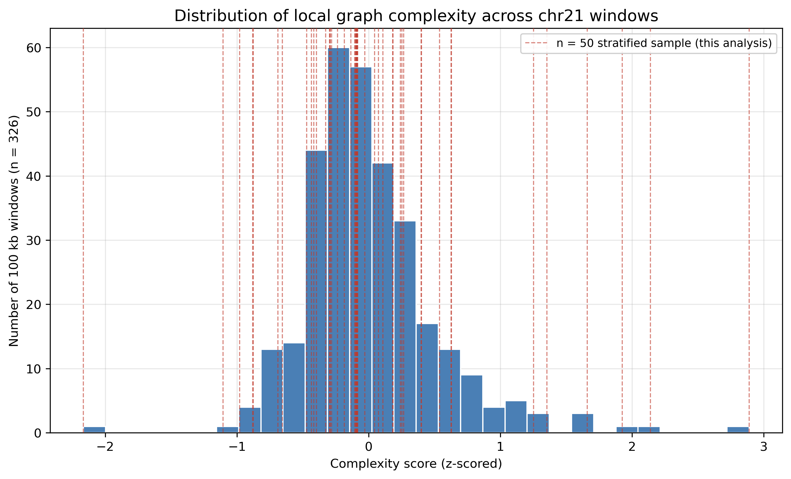

# Introduction

A pangenome graph represents many haplotypes at once, rather than forcing
every sample onto one linear reference. The PanGenome Graph Builder (PGGB)
builds such graphs without designating any input as privileged, aligning
all haplotypes to one another and constructing the graph directly from that
all-to-all alignment [@Garrison2024PGGB], and it is one of the methods the
Human Pangenome Reference Consortium (HPRC) uses to build its
population-scale pangenome graph from long-read haplotype assemblies
[@Liao2023HPRC; @Lucas2026HPRC2]. `vg giraffe` was introduced as a
short-read mapper for graphs of this kind, seeding against a curated set of
haplotype paths rather than the whole graph, which is what makes mapping to
a graph with hundreds of haplotypes tractable at all [@Siren2021Giraffe];
long-read mapping was added subsequently [@Chang2025Giraffe].

Whether that combination scales past a single locus is still an open
question. Chang and colleagues, describing the current state of Giraffe,
report that they "have not been able to construct indexes for Giraffe" for
PGGB graphs at genome scale, and attribute this directly to PGGB's
reference-free topology [@Chang2025Giraffe]. That is a statement about
outcome, not mechanism: it does not say what fraction of a genome would be
affected, whether difficulty is concentrated in particular kinds of
sequence, or whether topological difficulty and mapping inaccuracy are the
same failure mode or two different ones.

Existing work on pangenome region difficulty answers adjacent questions.
Li defines sample-agnostic "easy" regions for short-read variant calling by
k-mer uniqueness across hundreds of assemblies, entirely independent of any
graph [@Li2025EasyRegions]. Andreace and colleagues, and Dubois and
colleagues, compare graphs built from the same genomes by different
construction methods, and both find that the resulting structural
disagreement concentrates in tandem repeats and other low-complexity
sequence [@Andreace2023Comparing; @Dubois2025EditDistance]. None of these
studies asks whether a single graph's own local topology predicts what
happens when that graph is indexed and mapped against.

We tested this directly on chromosome 21 of the HPRC release 2 PGGB graph,
at a scale small enough to screen exhaustively: every 100 kb window on the
chromosome. For each window we computed an explicit topology-based
complexity score, and separately annotated known problem sequence classes
(segmental duplications, large tandem repeats) from public UCSC tracks. We
then asked whether either measure is associated with whether `vg autoindex`
and `vg giraffe`/`vg surject` complete for a region, and whether either is
associated with the accuracy of the resulting short-read alignments once
they do.

# Methods

## Graph and reference data

We used a chromosome 21 PGGB pangenome graph (parameters `p98-k311`) built
from a pre-release snapshot of HPRC release 2, dated 14 October 2025 and
not yet fully quality-controlled or formally published at the time of
download, per the HPRC's own pangenome resources repository. The graph
contains GRCh38 and CHM13 as reference paths alongside 464 HPRC year-2
haplotypes (466 haplotype/reference paths in total)
[@Lucas2026HPRC2; @Garrison2024PGGB]; this haplotype count is specific to
our snapshot and does not necessarily match later, fully quality-controlled
releases of the same resource. HPRC release 2 is, in its completed form,
roughly a fivefold expansion, in genome number, over the original draft
pangenome [@Liao2023HPRC; @Lucas2026HPRC2]. Chromosome 21 was chosen as the
smallest human autosome, to keep chromosome-scale extraction and screening
tractable on a single workstation. An independent GRCh38 chromosome 21
FASTA (UCSC `hg38`) was used for N-content screening and as a
graph-independent coordinate reference. All graph operations (`build`,
`extract`, `stats`, `degree`, `viz`) used the odgi toolkit
[@Guarracino2022ODGI]. Full provenance, including checksums and download
dates for every input file, is recorded alongside this repository.

## Candidate window screening

Every non-overlapping 100 kb window on chromosome 21 was considered, after
excluding the first and last 2% of the chromosome and any window with more
than 5% N content in the GRCh38 reference, leaving 367 candidate windows.
Each was extracted from the graph with `odgi extract` and summarized with
`odgi stats` and `odgi degree`. Windows were dropped from further analysis
under two criteria. First, a degenerate-window filter
(`edge_count == 0`, or fewer than 400 raw path fragments, or an extracted
size more than three times the requested window) removed 22 windows
clustered in the pericentromeric and acrocentric part of the chromosome,
leaving 345. Second, because the raw path-fragment count used above does
not distinguish a haplotype that is finely fragmented from a haplotype that
is simply absent, we additionally counted the number of *distinct*
haplotypes actually threading each window (parsed from the PanSN
`sample#hap` path-name prefix via `odgi paths -L`). Nineteen windows, all
within a contiguous stretch immediately flanking the centromere, had
fewer than 450 of the 466 possible haplotypes represented and were removed,
leaving 326 windows that were carried forward for scoring and sampling.

## Complexity score

For each of the 326 valid windows we computed four graph-topology
statistics from `odgi stats`/`odgi degree`: node density (nodes per
kilobase of reference sequence), the edge-to-node ratio, sequence inflation
(total graph sequence relative to the reference interval), and maximum node
degree. Each statistic was log10-transformed and z-scored across the
326-window population, and the four z-scores were averaged into a single,
unitless local complexity score. The score is a purely topological
summary: it carries no information about sequence identity or content,
which is what distinguishes it from the hazard annotation described next.

## Known-hazard annotation

Complexity score alone cannot see sequence similarity to other parts of the
genome, since it is computed from one local subgraph. To capture that
separately, every valid window was checked against two UCSC tracks for
chromosome 21, `genomicSuperDups` [@Bailey2001SegDup] and `simpleRepeat`
(Tandem Repeats Finder, [@Benson1999TRF]), both retrieved once for the whole
chromosome and intersected locally rather than queried per window
[@Kent2002UCSC]. A binary hazard flag was set for a window if it overlapped
a segmental duplication at 90% identity or higher, or a tandem-repeat array
spanning 1.4 kb or more; these thresholds were chosen because they
correctly flagged every problem window identified during preliminary,
hand-picked testing of this pipeline: two segmental duplications (one
inter-chromosomal, one intra-chromosomal) and two large tandem-repeat or
NUMT-containing windows. Under this definition, 77 of the 326 windows
(23.6%) carry a hazard flag. Crossing
the hazard flag with a complexity tier (above or below the population
median complexity score) gives a 2x2 design with four strata. Two of the
four calibration windows were subsequently drawn into the 50-region
evaluation sample described below by the rank-sampling procedure; this is
relevant to how the flag's apparent performance in that sample should be
read (see Discussion).

## Region sampling and pipeline

Fifty windows were rank-sampled within each of the four
complexity-tier-by-hazard-status strata, 25 per tier and 25 per hazard
status by construction, so that rare combinations such as a low-complexity
window carrying a known hazard would not be missed by chance. Each of the
50 regions was carried through an identical pipeline. Sequence graphs were
extracted with `odgi extract` at the default subpath-merging distance; a
minority of extractions that expanded past three times the requested window
size, a known behaviour of the default merge distance next to large
collapsed repeats, were re-extracted with merging disabled. Giraffe indexes
were built with `vg autoindex --workflow sr-giraffe` [@Siren2021Giraffe].
For each region we simulated 30,000 error-free paired-end 150 bp reads
(fragment length 350 bp ± 35 bp) from the GRCh38 interval with `wgsim`
[@Li2011Wgsim], with a fixed seed for reproducibility. Reads were mapped
with `vg giraffe` and surjected onto the linear GRCh38 path with
`vg surject` [@Siren2021Giraffe]; BAM records were inspected with
`samtools` [@Danecek2021Samtools]. A mapped read was scored correct if its
absolute position, converted back from the region's local subpath
coordinate, fell within 10 bp of either candidate fragment-boundary
position implied by the simulated fragment (the read simulator does not
record simulated strand, so either boundary is an acceptable match). Every
pipeline stage for a region (extraction, indexing, simulation, mapping,
surjection, evaluation) was run under a 30-minute wall-clock budget on a
single machine (Apple Silicon, 16 cores, 128 GB memory); a region that had
not produced a result within that budget was recorded as a pipeline
failure. Two genes flagged as biologically notable in this analysis
(the ribosomal RNA gene `RNA5-8SN3` and the `MIR6724` microRNA cluster
overlapping the single most complex of the 345 scored windows, which was
later excluded from the final 326-window pool by the haplotype-
representativeness filter) were identified by looking up their coordinates
against Ensembl gene annotation [@Dyer2025Ensembl]. All downstream
tabulation and the figures in this report were produced with pandas
[@McKinney2010Pandas] and matplotlib [@Hunter2007Matplotlib]. Associations
between complexity tier or hazard status and pipeline completion were
tested with two-sided Fisher's exact tests; differences in the full
accuracy distribution between groups were tested with two-sided
Mann-Whitney U tests; both were computed with SciPy
[@Virtanen2020SciPy].

# Results

Forty-six of the 50 sampled regions completed extraction, indexing,
mapping and surjection within the 30-minute budget; four did not. All four
incomplete regions were in the above-median complexity tier: 4 of 25
high-complexity regions did not complete (16%, 95% exact binomial CI
5-36%), compared with 0 of 25 low-complexity regions (0%, CI 0-14%). By
hazard status, 3 of 25 hazard-flagged regions did not complete (12%, CI
3-31%) and 1 of 25 regions with no hazard flag did not complete (4%, CI
0-20%). Neither association with completion reached significance in a
two-sided Fisher's exact test at this sample size (complexity tier,
p = 0.11; hazard status, p = 0.61).

Among the 46 regions that completed, median accuracy was 99.997% in the
low-complexity tier and 99.987% in the high-complexity tier; minimum
accuracy in the same two tiers was 98.7% and 99.3%. A two-sided
Mann-Whitney U test on the full accuracy distributions found this
difference significant (p = 0.04). By hazard status, mean accuracy was
99.92% among regions with no hazard flag and 99.84% among hazard-flagged
regions, and minimum accuracy was 99.53% and 98.69%; the corresponding
Mann-Whitney U test on the full distributions was not significant
(p = 0.60). The single lowest-accuracy region in the sample (98.69%) was
also the single lowest-complexity region in the 326-window population
(complexity score -2.17). This region carried a hazard flag:
`genomicSuperDups` lists 41 segmental-duplication entries overlapping the
window at 90-97% identity, matching paralogous sequence on six other
chromosomes; it is also one of the four windows used to calibrate the
hazard-flag thresholds described in Methods.

Two regions encountered during preliminary testing of this pipeline did
not complete under a shorter 10-minute budget and completed successfully
once given 30 minutes; both are part of this sample. One is the single
highest-complexity region tested (complexity score 2.89), which completed
at 99.78% accuracy after approximately 26 minutes of total wall-clock
time, of which 36 seconds were spent on index construction (the value
reported in the per-region results table). The other is a
near-median-complexity region (complexity score -0.09) that completed at
99.90% accuracy; its results-table index-construction time (0.39 seconds)
reflects the same single pipeline stage, not the longer total time
observed for this region during preliminary testing.

Complexity score across the 326-window population was strongly
right-skewed, with 77.6% of windows falling within half a standard
deviation of the median (Figure \ref{fig1}). The relationships among
complexity score, hazard status, pipeline completion, and mapping accuracy
across all 50 sampled regions are summarized in Figure \ref{fig2}.




# Discussion

Complexity score and hazard status point toward different outcomes, but at
this sample size the formal statistical support for that pattern is mixed
rather than clean. Complexity tier shows a large descriptive difference in
completion rate (0% failure below the population median score, 16% above
it), yet this difference does not reach significance in a two-sided
Fisher's exact test (p = 0.11); the same is true for hazard status and
completion (4% versus 12%, p = 0.61). For accuracy, the pattern one would
expect from the segmental-duplication case described in Results, that
hazard-flagged regions map less accurately, does not hold up under formal
testing either: the full accuracy distributions by hazard status are
statistically indistinguishable (p = 0.60), even though the single
lowest-accuracy region in the sample carries a hazard flag. Complexity
tier is the one comparison that reaches nominal significance for accuracy
(p = 0.04); under the two-predictor framing above, accuracy was expected
to track hazard status rather than complexity, so the one significant
result falls on the measure that was not expected to carry it. The
underlying effect is also small, a 0.01 percentage-point difference in
median accuracy between tiers, and would not survive a Bonferroni
correction for the four comparisons reported here (corrected threshold
p < 0.0125). None of the four associations tested is robust enough at
n = 50 to support a clean division of labor between the two measures.

What the data support more confidently is a single, well-characterized
case rather than a population-level rule. A screen built on complexity
score alone would have classified this study's lowest-accuracy region, a
segmental duplication with 41 paralogous copies elsewhere in the genome,
as its safest, because a complexity score computed from a single local
subgraph cannot detect sequence identity elsewhere in the genome. That is
precisely the property a hazard annotation is designed to catch, and this
case is a genuine illustration of the limitation. It should be weighed
cautiously, however, because the same region was also one of the four
windows used to calibrate the hazard-flag thresholds in the first place
(see Methods): using its outcome to argue that the flag generalizes is
partly circular, and an independent test set would be needed to show that
a hazard flag chosen this way predicts accuracy in regions it was not
tuned on.

"Failed to complete" in this study means no result within a fixed
30-minute, single-machine budget, not proof that a region cannot be
indexed at all. Two regions in this dataset that initially did not
complete under a shorter 10-minute budget completed successfully once
given 30 minutes, and the 30-minute budget used throughout this study was
chosen using that same observation, so it is not an independently set
threshold. The 16% failure rate reported for the high-complexity tier is
accordingly better read as an upper bound under this specific,
self-selected compute budget than as a fixed property of the graph. The
underlying counts are also
small (4, 3, and 1 failure events out of 25 regions, respectively), so the
wide confidence intervals reported in the Results should be read alongside
the point estimates: the direction of each effect is clearer than its
exact magnitude, which is consistent with the non-significant test results
reported above.

Chang and colleagues report that Giraffe indexing has not been made to
work at genome scale for PGGB graphs [@Chang2025Giraffe]. We do not
resolve that problem, but these results sharpen what it looks like below
genome scale. Tractability failure at 100 kb is not confined to the single
most extreme window on the chromosome: 4 of the 25 above-median-complexity
regions sampled here failed to complete under an ordinary compute budget,
though the sample is too small to establish how reliably that rate
generalizes. A genome-wide extension of Giraffe indexing will need to
treat outright failure as an expected outcome to be measured and reported,
not an edge case to be debugged away.

Two practical points follow for anyone screening candidate regions at
scale, with the caveat above in mind. Existing, cheaply computed sequence
annotation, namely the segmental duplication and tandem-repeat tracks that
already exist for the human genome, is worth checking alongside any
topology-based complexity score, because complexity ranking alone
misclassified this study's worst-accuracy region as its safest; whether
that failure mode is common enough to matter at scale is a question this
sample is too small and too entangled with the calibration set to answer.
And because at least two regions in this study that looked like outright
failures under a short timeout turned out simply to be slow, whatever
timeout a larger screen adopts should be generous enough that "failed"
means something more than "ran out of patience."

Most of the limitations below trace back to a single cause: this work was
carried out during one BioHackathon, under a fixed and fairly short window
of both time and compute, and that constraint shaped the scope of the
study as much as any scientific choice did. All extraction, indexing, and
mapping ran on one workstation rather than a cluster or cloud allocation,
because no other compute was available during the event. The 30-minute
per-region timeout, as noted above, was set once two regions were observed
needing close to that long to finish, and it was also generous enough to
let the full 50-region pipeline complete inside the time remaining in the
hackathon; a more patient budget, or more machines run in parallel, would
plausibly change the specific failure counts reported above, as those same
two regions already demonstrate. Screening
was limited to chromosome 21, chosen as the smallest human autosome
specifically so that exhaustive 100 kb screening would finish in the
available time, so we did not test whether the failure and hazard rates
reported here hold on larger, more repeat-rich chromosomes with a
different balance of segmental duplication, tandem repeat, and
pericentromeric content. Reads were simulated error-free from the linear
reference rather than drawn from a real sequencing run, again because
acquiring and processing real short-read data at this scale was not
feasible inside the hackathon's time budget; this reports graph and mapper
behaviour under idealized input, not real Illumina sequencing performance.
And the sample of 50 regions, while stratified to guarantee coverage of
rare hazard-by-complexity combinations, has a size set by how many regions
could be carried through the full pipeline before time ran out, not by a
power calculation: the width of the confidence intervals reported in the
Results, and the largely non-significant formal test results reported in
this section, are a direct, quantitative consequence of that constraint.

One further limitation is not a matter of time or compute. A truth model
built from a single simulated coordinate per read cannot distinguish a
genuine mapping error from a read placed correctly at one of several
biologically valid locations in a duplicated region, precisely the
situation a hazard-flagged window is most likely to create, which would
bias our accuracy numbers downward rather than up. Real sequencing reads,
additional and larger chromosomes, a longer or resource-scaled timeout,
and a repeat-aware definition of mapping correctness would each remove one
of the constraints above; none of them calls for a different pipeline,
only for more time and compute than a single hackathon provides.

## Acknowledgements

We thank the organizers and participants of BioHackathon 2026 for the time
and computing environment that made this analysis possible, and the HPRC,
PGGB, and vg development teams for making the underlying graphs and tools
openly available.

# References

```{=latex}
\AtEndDocument{%
```

# Appendices

Full methodology detail, per-region result tables, and the narrative logs
documenting the preliminary hand-picked testing referenced above are
available in this repository's `README.md` and `logs/` directory.

```{=latex}
}
```
